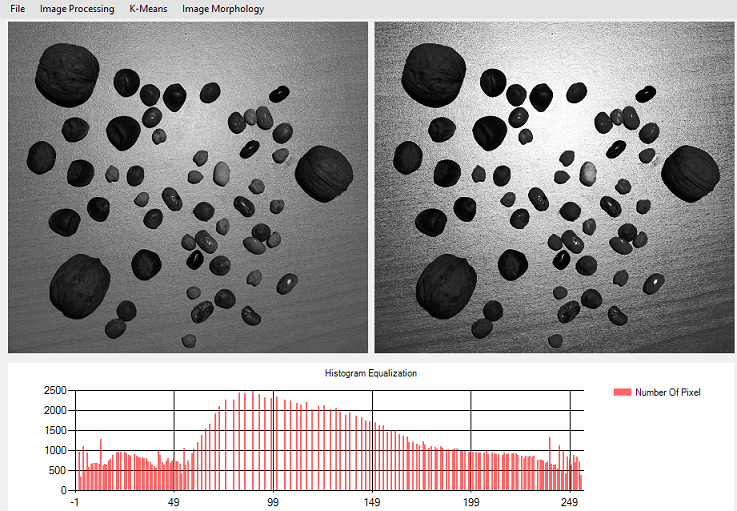
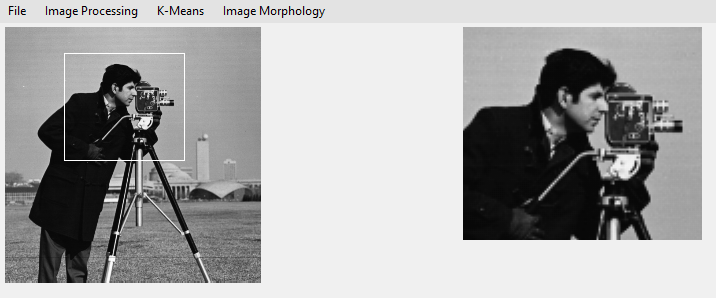
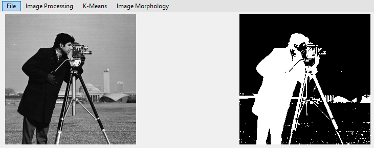
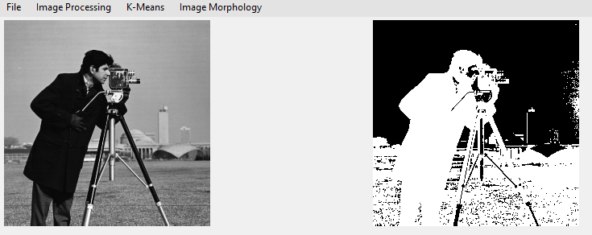
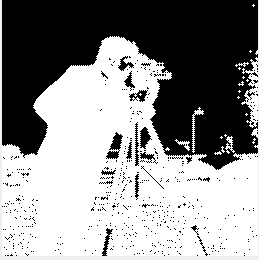
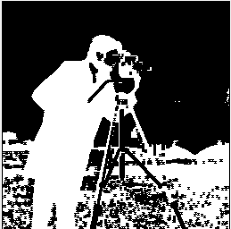
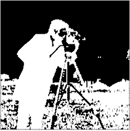
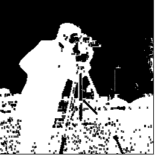
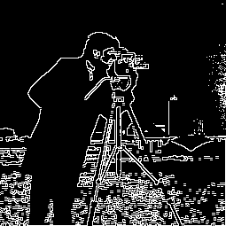
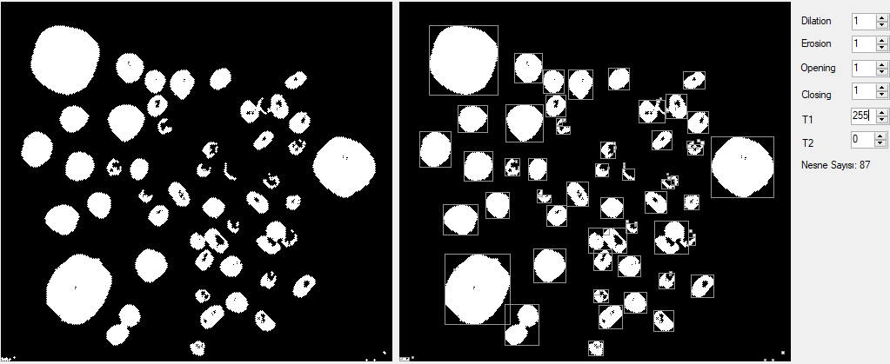

# Image Processing

- IDE: Visual Studio 2017
- Windows SDK Version: 10.0.14393.0

### Histogram Equalization

### Digital Zoom

### Binary Image (Euclidean Distance)

### Binary Image (Mahalanobis Distance)

### Image Morphology (Dilation-Erosion-Opening-Closing-Boundary)

    

### Object Bounding Box

 

